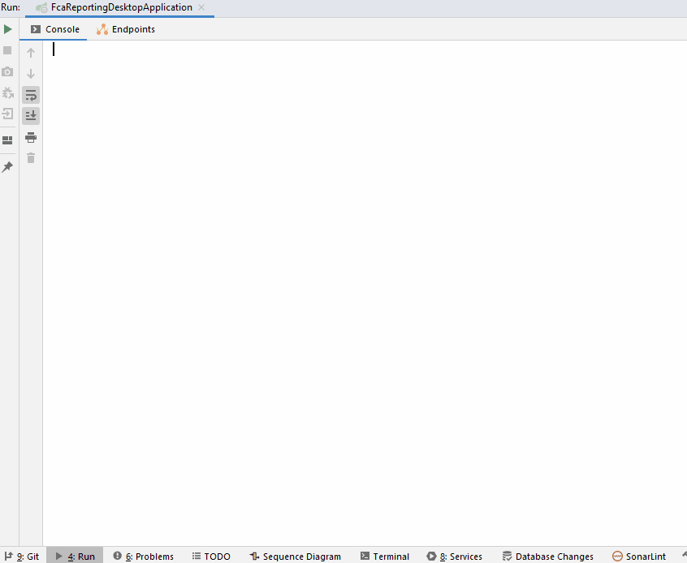

# ScopeReportingDemo
There is no source code to this repository as it is proprietary to my company. But I have demonstrated the application in Readme.md 

I presented this proof of concept at my current company, Scope Group. Our operations department asked the development team to provide tools to perform administrative tasks. 

This JavaFX application is integrated with the existing Spring Boot services that we have been using in the company for a long time. By inserting a new controller layer between the JavaFX UI and the mentioned services, it was not necessary to change a single line of existing code in the service layer and database. 

